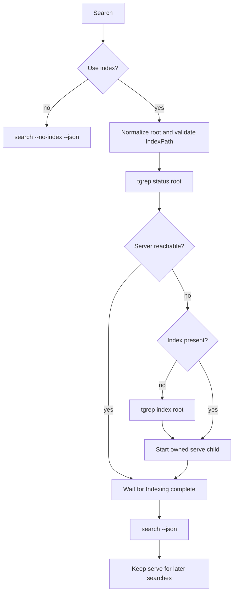

# Architecture

## Boundaries

`App.xaml` loads Fluent resources; `MainWindow` hosts `NavigationView`, search, and `SettingsPage`. `MicaBackdrop` is enabled only when supported. `GridSplitter` is the CommunityToolkit.WinUI control; `ObservableObject`, `RelayCommand`, and `AsyncRelayCommand` come from CommunityToolkit.Mvvm.

`MainViewModel` owns UI state, commands, per-file grouping, counts, and settings. Core `TgrepGui.Core` is a .NET 10 library with no WinUI references and is tested separately. `TgrepClient` coordinates lifecycle; `ProcessRunner` owns transient processes; `TgrepJsonParser` converts the protocol; `Arguments` builds argv; `EditorLauncher` opens the result.

## Argv

Every argument goes through `ProcessStartInfo.ArgumentList`: the runtime performs Windows quoting. No command string is concatenated, no shell is used, and paths are not interpolated in PowerShell/cmd.

| UI | tgrep argument |
|---|---|
| Query | `-- <pattern> <root>` after all options |
| Include | One `-g <glob>` per filter |
| Exclude | One `-g !<glob>` per filter |
| Directory `bin/` | `-g !bin/**` |
| Ignore case | `-i` |
| Literal text | `-F` |
| Whole word | `-w` |
| Use index off | `--no-index` |
| Non-empty IndexPath | `--index-path <absolute-directory>` on **every** command |
| Always on search | `--json --line-buffered --color never -n` |

Negative globs are used for excluded directories instead of changing `index`/`serve` with `--exclude`. Changing a UI filter therefore does not leave a permanently incomplete index for the next search. Include filters come first; exclusions take precedence per tgrep/ripgrep semantics. Standard tgrep ignore files remain active.

GUI CLI options (`--folder/-f`, `--include-files/-i`, `--exclude-files/-e`, `--text/-t`) prefill the form and are not forwarded directly to tgrep.

## Serve lifecycle

`EngineUpdater` checks the stable GitHub release API in a background task, using the process architecture (x64/ARM64). A configured engine path bypasses updates. A verified cached engine is selected once at startup and copied into search/settings snapshots, so background installation cannot switch a listing or preview to another executable. Startup verifies its local SHA-256 and runs the compatibility probe, falling back to the previous cached engine and then normal discovery. A newer bundled engine wins over older cached engines.

Installation is serialized with an exclusive file lock and uses bounded downloads, an exact official release URL, GitHub's SHA-256 archive digest, and extraction of only the root `tgrep.exe` entry. A temporary fixture exercises actual `TgrepClient` listing, previews, Unicode highlights, flags, no-match handling, index creation and server readiness. A second fixture exercises old-engine → new-engine → old-engine reuse of an index. The updater never opens project indexes. Processes are bounded by cancellation/timeouts and disposed before fixture cleanup. Immutable version/hash directories preserve old executables; only the small current/previous manifest is replaced atomically after success. Interrupted downloads and failed probes do not activate the candidate. Unsupported architectures, offline access, rate limits and other update errors are recorded in Log while searches continue. Shutdown and settings changes cancel and await background update work.

- Roots are normalized with `Path.GetFullPath` and, on Windows, `GetFinalPathNameByHandleW`: junctions, symlinks, device prefixes, trailing slashes, and case do not multiply servers for the same folder.
- A dictionary of **app-owned** servers per root is protected by a semaphore. Each entry keeps the `Process` object, executable, index path, and stdout/stderr drain tasks.
- A `.tgrep` directory alone does not mean an index exists: `status` is parsed. That command can exit 0 with “No index found”. The response distinguishes on-disk index, server, and in-progress indexing. Unknown formats or timeouts become visible errors, not an invitation to overwrite the index.
- `status` queries time out after 5 seconds. Startup with no response times out after 30 seconds; waiting for indexing that is actually in progress is cancellable and does not impose an arbitrary limit for large repositories. Polling while waiting starts at 300 ms and doubles until 1 second.
- If `meta.json` exists, `root_path` must match the root. A custom index cannot be shared across projects. The index directory cannot be the root itself.
- An external server is used but not added to the owned-process dictionary. The PID reported by `status` is diagnostic: **it is never used to decide which process to terminate**.
- Choosing a project folder (browse, recent item, committed typed path, last folder at startup) starts `index`/`serve` in the background when **Use index** is on. A later search on the same root reuses that owned server. Changing folder or turning the index off cancels an in-flight warmup so a search on another root is not blocked behind the previous index. Warmup errors are warnings; the form stays editable.
- `RestartAsync` stops only the owned `Process` for the current root, then starts/waits for the server. If it finds an external server it reports that the owner must stop it. It does not rebuild an existing index.
- If two GUI instances try to start together, tgrep’s `serve.lock` arbitrates exclusivity. If the process just started exits but `status` finds another ready server, the app reuses the latter.
- Changing index path or executable retires the old owned server for the same root before the new start. At most two app-owned servers are retained. Access refreshes a monotonic LRU timestamp; starting a third retires the least recently used child, preserving its on-disk index. External servers are never evicted.
- The watcher belongs to tgrep. No Git watcher or `index` command is tied to a branch change in the GUI.

## Processes, cancellation, and shutdown

tgrep processes use `UseShellExecute=false`, `CreateNoWindow=true`, redirected stdout/stderr, and UTF-8. Both streams are read concurrently. Per-process diagnostic capture is capped at 32 KiB. A parser failure stops the producer immediately: the first completed/failed task among stdout, stderr, and exit is awaited, avoiding deadlock when the process keeps writing.

Cancellation stops only the owned transient process (`search`, `status`, `index`) and waits for it to exit. It does not stop external servers or a reusable owned server. Results already shown remain, with a “partial results” message. A server still indexing may finish in the background.

`AppWindow.Closing` defers close, cancels and awaits the UI operation, then runs `DisposeAsync` on owned servers. Only then does it close the window. `Process` handles are used; never `Stop-Process -Name tgrep`, global enumerations, or PIDs reconstructed from files.

A forced GUI process exit from Task Manager or a system crash does not run the async shutdown path: a child server may stay alive and will be reused as external on the next launch. No Windows service is installed.

## Streaming and UI thread

Search listing runs on a .NET worker. stdout is read as UTF-8 bytes (no `StreamReader` on that pipe) and split on newlines; `Utf8JsonReader` parses each object. `begin`/`end` events are recognized; only `match` creates hits. `summary` and `context` do not produce rows. `text` and base64 `bytes` fields are supported. Relative paths are resolved against the root used by the process.

The listing pass records per-file paths and occurrence counts only: line text and highlights are not kept. The right-hand pane is not filled during that pass. After the listing finishes, or when the user selects a file, a second search uses that file as the tgrep `PATH` and `-m 10000`. A visible warning is shown if the file has more matches than were loaded. Each preview also has an 8 MiB estimated retained-data budget (one oversized first line is allowed). Up to four inactive previews are cached, within 32 MiB estimated; selection removes a preview from that cache and makes it active. Eviction clears text, highlights and the backing list capacity. Returning to an evicted preview reloads it. File selection cancels and serializes previous loads, preventing an older cancellation from clearing newer rows; shutdown awaits those loads.

`submatches.start/end` offsets are UTF-8 bytes; the parser converts them to UTF-16 indexes for `TextHighlighter` in one forward scan. Only trailing line terminators are stripped; leading spaces and indentation are kept. The counter sums occurrences, not just lines.

A `Channel` bounded to 1,024 items applies backpressure. The consumer reuses its batch buffer, updates the file-count label once per batch, and adds up to 128 results per batch and yields about every 16 ms so input and paint keep running. Observable collections are mutated only on the UI thread. ListViews virtualize items. There is no silent truncation of the file list.

A UI timer reads progress, last server status, and the log queue every 100 ms during operations and every second while idle. The last 1,000 lines are kept in the flyout and at most 2,000 lines are queued. Strings containing `warning`, including `warning: no index`, or `scanning every file` feed the InfoBar and warning count. JSON errors and exit codes other than 0/1 are visible; exit 1 is “no matches”. Indexed counts are updated during preparation and at the end of a search; they are not a continuous idle monitor.

## Persistence and file opening

`SettingsStore` uses `%AppData%\tgrep-gui\settings.json`, with a semaphore and atomic replacement via a temporary file. At most 12 roots are remembered; queries, contents, and logs are not saved. Settings are snapshotted when a search starts, so form changes do not alter argv already running.

`EditorLauncher` splits the template with `CommandLineToArgvW`, then substitutes tokens and uses `ArgumentList`. The editor is an interactive process, with no stdout/stderr capture; if none is configured the Windows file association is used. Explorer is started explicitly to select the file. The clipboard uses `DataPackage`.

## Build and tests

The application project explicitly excludes `Core`, `Tests`, `.tools`, and `artifacts` from automatic source inclusion. The core library is referenced as a project. Unpackaged publish is self-contained and single-file (`PublishSingleFile`, with Windows App SDK and `tgrep.exe` bundled); the first launch extracts to a temporary folder. The published host must stay named `tgrep-gui.exe` so WinUI can load `tgrep-gui.pri`. Release zips therefore contain that one file rather than a renamed EXE. The MSIX profile is optional and does not sign or install certificates.

`Tests/Program.cs` checks argv, Unicode, base64, status, settings, pipes, and cancellation. `FakeTgrep` reproduces large stderr, waits, and malformed JSON. When a real tgrep path is passed, the suite creates temporary repositories and exercises the full cycle, including external server survival. No test uses existing project data or indexes.

The UTF-8 pump scans only newly received bytes with span-based newline search, avoiding quadratic rescanning on fragmented long lines. JSON event envelopes are value types and common event names reuse literals. Adjacent hits for the same file are coalesced before the channel: the first hit is immediate; subsequent groups flush on file changes, 128 rows, completion, or the next hit after 16 ms. See PERFORMANCE.md for measurements and limits.
