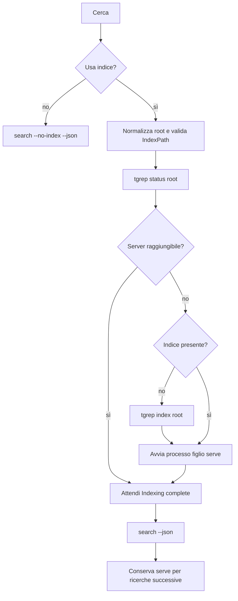

# Architettura

## Confini

`App.xaml` carica le risorse Fluent; `MainWindow` ospita `NavigationView`, ricerca e `SettingsPage`. `MicaBackdrop` viene attivato solo quando supportato. `GridSplitter` è il controllo CommunityToolkit.WinUI; `ObservableObject`, `RelayCommand` e `AsyncRelayCommand` provengono da CommunityToolkit.Mvvm.

`MainViewModel` gestisce stato UI, comandi, raggruppamento per file, conteggi e impostazioni. Il core `TgrepGui.Core` è una libreria .NET 10 senza riferimenti WinUI e viene testato separatamente. `TgrepClient` coordina il ciclo di vita; `ProcessRunner` possiede i processi transitori; `TgrepJsonParser` converte il protocollo; `Arguments` genera argv; `EditorLauncher` apre il risultato.

## Argv

Ogni argomento passa attraverso `ProcessStartInfo.ArgumentList`: il runtime esegue il quoting Windows. Non viene concatenata una stringa di comando, non viene usata una shell e non vengono interpolati percorsi in PowerShell/cmd.

| UI | Argomento tgrep |
|---|---|
| Query | `-- <pattern> <root>` dopo tutte le opzioni |
| Includi | Un `-g <glob>` per filtro |
| Escludi | Un `-g !<glob>` per filtro |
| Directory `bin/` | `-g !bin/**` |
| Ignora maiuscole | `-i` |
| Testo letterale | `-F` |
| Parola intera | `-w` |
| Usa indice disabilitato | `--no-index` |
| IndexPath non vuoto | `--index-path <absolute-directory>` su **tutti** i comandi |
| Sempre sulla ricerca | `--json --line-buffered --color never -n` |

Si usano globs negativi per le directory escluse anziché alterare `index`/`serve` con `--exclude`. In questo modo modificare un filtro UI non lascia un indice permanentemente incompleto per la ricerca successiva. I filtri di inclusione precedono le esclusioni; queste ultime hanno precedenza secondo la semantica tgrep/ripgrep. Gli ignora-file standard di tgrep restano attivi.

Le opzioni CLI della GUI (`--folder/-f`, `--include-files/-i`, `--exclude-files/-e`, `--text/-t`) precompilano il form, senza essere inoltrate direttamente a tgrep.

## Serve lifecycle

- Root normalizzate con `Path.GetFullPath` e, su Windows, `GetFinalPathNameByHandleW`: junction, symlink, prefissi device, slash finali e maiuscole non moltiplicano i server della stessa cartella.
- Dizionario dei server **di proprietà dell’app** per root, protetto da un semaforo. Ogni voce conserva l’oggetto `Process`, l’eseguibile, il percorso indice e i task che drenano stdout/stderr.
- La presenza di una directory `.tgrep` da sola non indica che esista un indice: si interpreta `status`. Questo comando può restituire exit 0 con “No index found”. La risposta distingue indice su disco, server e indicizzazione in corso. Formati sconosciuti o timeout diventano errori visibili, non un invito a sovrascrivere l’indice.
- Le query `status` hanno timeout 5 secondi. L’avvio senza risposta ha timeout 30 secondi; l’attesa di una indicizzazione effettivamente in corso è cancellabile e non impone un limite arbitrario per repository grandi.
- Se esiste `meta.json`, `root_path` deve corrispondere alla root. Un indice personalizzato non può essere condiviso tra progetti. La directory indice non può coincidere con la root stessa.
- Un server esterno viene utilizzato ma non inserito nel dizionario dei processi posseduti. Il PID riportato da `status` è diagnostico: **non viene mai usato per decidere quale processo terminare**.
- `RestartAsync` ferma soltanto il `Process` posseduto per la root corrente, poi avvia/attende il server. Se trova un server esterno segnala che deve essere arrestato dal suo proprietario. Non rigenera un indice esistente.
- Se due istanze della GUI tentano l’avvio insieme, `serve.lock` di tgrep arbitra l’esclusività. Se il processo appena avviato termina ma `status` trova un altro server pronto, l’app riutilizza quest’ultimo.
- Cambiare percorso indice o eseguibile ritira il vecchio server posseduto della stessa root prima del nuovo avvio. I server di altre root vengono mantenuti fino a Esci per il riuso.
- Il watcher appartiene a tgrep. Nessun watcher Git o comando `index` viene associato al cambio di branch nella GUI.

## Processi, cancellazione e chiusura

I processi tgrep usano `UseShellExecute=false`, `CreateNoWindow=true`, stdout/stderr rediretti e UTF-8. I due stream vengono letti contemporaneamente. La cattura diagnostica per processo è limitata a 32 KiB. Una failure del parser interrompe subito il producer: si attende il primo task completato/fallito fra stdout, stderr ed exit, evitando deadlock quando il processo continua a scrivere.

La cancellazione termina il solo processo transitorio posseduto (`search`, `status`, `index`) e ne attende l’uscita. Non arresta server esterni né un server posseduto riutilizzabile. I risultati già visualizzati restano, accompagnati da “risultati parziali”. Il server in indicizzazione può completare in background.

`AppWindow.Closing` rinvia la chiusura, annulla e attende l’operazione UI, poi esegue `DisposeAsync` sui server posseduti. Solo al termine chiude la finestra. Vengono usati handle `Process`, mai `Stop-Process -Name tgrep`, enumerazioni globali o PID ricostruiti da file.

L’uscita forzata del processo GUI da Task Manager o un crash del sistema non esegue il flusso asincrono di chiusura: un server figlio può restare attivo e sarà riutilizzato come esterno al successivo avvio. Non viene installato un servizio Windows.

## Streaming e thread UI

`SearchAsync` gira in un worker .NET. Il parser legge un oggetto JSON per riga; gli eventi `begin`/`end` sono riconosciuti, mentre solo `match` crea risultati. `summary` e `context` non producono righe di match. I campi `text` e `bytes` base64 sono supportati. I percorsi relativi vengono risolti rispetto alla root usata dal processo.

Gli offset `submatches.start/end` sono byte UTF-8; il parser li converte in indici UTF-16 per `TextHighlighter`. Vengono rimossi soltanto i terminatori di riga finali; spazi iniziali e indentazione sono conservati. Il contatore somma le occorrenze, non soltanto le righe.

Un `Channel<SearchMatch>` limitato a 1.024 elementi applica backpressure. Il consumer aggiunge fino a 128 risultati per batch, poi cede il thread per input/render. Le collezioni osservabili vengono modificate solo sul thread UI. I ListView virtualizzano gli elementi; i risultati raccolti sono conservati in memoria senza troncamento silenzioso.

Un timer UI a 100 ms legge progresso, ultimo stato server e coda di log. Sono conservate le ultime 1.000 righe nel flyout e al massimo 2.000 righe in attesa. Le stringhe contenenti `warning`, compreso `warning: no index`, o `scanning every file` alimentano l’InfoBar e il conteggio avvisi. Errori JSON e codici diversi da 0/1 sono visibili; exit 1 è “nessuna corrispondenza”. I conteggi indicizzati vengono aggiornati durante la preparazione e al termine della ricerca, non sono un monitor continuo a riposo.

## Persistenza e apertura file

`SettingsStore` usa `%AppData%\tgrep-gui\settings.json`, con semaforo e sostituzione atomica tramite file temporaneo. Si ricordano al massimo 12 root, senza salvare query, contenuti o log. Le impostazioni vengono fotografate all’avvio della ricerca, quindi modifiche al form non alterano argv già in esecuzione.

`EditorLauncher` suddivide il template con `CommandLineToArgvW`, poi sostituisce i token e usa `ArgumentList`. L’editor è un processo interattivo, senza cattura stdout/stderr; se non configurato viene usata l’associazione file Windows. Explorer viene avviato esplicitamente per la selezione del file. Gli appunti usano `DataPackage`.

## Build e verifiche

Il progetto applicazione esclude esplicitamente `Core`, `Tests`, `.tools` e `artifacts` dall’inclusione automatica dei sorgenti. La libreria core è referenziata come progetto. Il default è .NET framework-dependent con runtime Windows App SDK incluso; Publish Unpackaged include anche .NET. Il profilo MSIX è facoltativo e non firma/installa certificati.

`Tests/Program.cs` esegue controlli su argv, Unicode, base64, status, impostazioni, pipe e cancellazione. Il programma `FakeTgrep` riproduce stderr abbondante, attese e output JSON malformato. Passando un percorso tgrep reale, la suite crea repository temporanei e prova il ciclo completo, compresa la sopravvivenza di un server esterno. Nessuna prova usa dati o indici di progetto esistenti.
