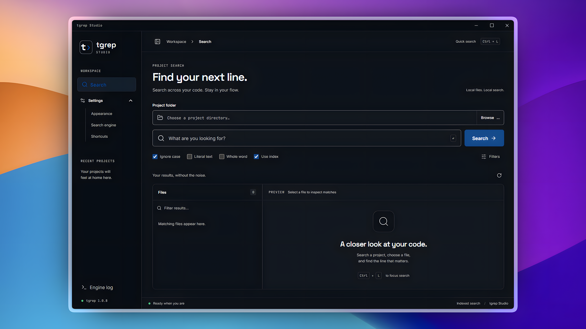

# tgrep-gui

Windows desktop GUI for [Microsoft tgrep](https://github.com/microsoft/tgrep), written in **Rust / Tauri 2 / React**. Search a folder, pick a matching file, and inspect highlighted lines.

Microsoft tgrep is installed and updated from Settings (**Update tgrep**), not shipped inside the app zip.



## Install

1. Download **tgrep-gui-win-x64-setup.exe** or **tgrep-gui-win-x64.zip** from [Releases](https://github.com/devchristian1337/tgrep-gui/releases).
2. **Installer:** run the setup (per-user, no administrator account). It can bootstrap WebView2 if Windows does not already have it.
3. **Zip:** extract `tgrep-gui.exe` and double-click it. In Settings, use **Update tgrep** to download the official Windows engine (or put `tgrep.exe` on PATH).

Windows 10 64-bit (build 17763) or later is required. Windows 11 already includes WebView2.

A configured `tgrep.exe` path in Settings takes precedence over a verified update, then PATH. No project paths, queries, or file contents are sent over the network. Engine updates download only the official Microsoft tgrep Windows zip from GitHub and verify its SHA-256 digest before it is used.

## Usage

1. Choose a folder with **Browse**, paste a path, or pick a recent project.
2. Optional globs: `*.cs; *.xaml`, `*.{js,ts}`, or `"my files/**"`. Spaces, commas, and semicolons separate filters; quotes preserve spaces. Commas inside `{...}` or `[...]` are preserved.
3. To exclude directories use `bin/; obj/; node_modules/` (or `**/bin/**`); for files use `*.min.js`.
4. Enter a regex, or enable **Literal text**, then press **Search** or Enter.
5. Pick a file on the left. The right pane loads that file’s highlighted lines (up to 10,000 matches per file).

| Shortcut | Action |
|---|---|
| Ctrl+L | Show search and select the query text |
| Enter, in the search box | Start search |
| Esc | Cancel search or index preparation |
| F3 or double-click a line | Open in the editor at that line |
| Click / Ctrl-click / Shift-click | Select preview lines |
| Ctrl+C in the preview | Copy selected lines |

**Filters** shows or hides the include/exclude fields. **Engine log** keeps the last 1,000 diagnostic lines in memory; it is not written to disk.

### Search, index, and branch changes

With **Use index** on, the app runs `tgrep status`. If there is no index it runs `index`, showing progress; then it starts `serve` and waits until the index is ready. An already running server is reused, including one started externally.

Later searches reuse the server. The tgrep watcher handles edits and branch changes: **the GUI does not rerun `index` on a branch change**. After a large change, wait for the watcher and search again. If results look stale, restart the server from the UI, then Search; restart does not rebuild an existing index. The app refuses to restart an external server and explains why.

Turning **Use index** off passes `--no-index` and neither builds an index nor starts a server. Servers already started remain available.

**Cancel** stops the current search or `index` process and keeps partial results. A server already started stays up. On app close, only child processes started by the app itself are terminated. Processes are never killed by name.

Search display is bounded at 100,000 files. The file list streams as JSON records arrive. Line text is loaded when a file is selected.

### Settings and editor

Settings are stored at `%AppData%\io.github.devchristian1337.tgrep-studio\settings.json` and written atomically. If the file is unreadable it is preserved until you save settings explicitly.

Leave **tgrep executable** empty to use a verified update, then PATH. **Update tgrep** checks GitHub for a newer stable Windows build, verifies it, and installs it for the next launch. Automatic updates are on by default and skip a custom engine path. A custom index path must be **absolute and dedicated to a single folder**. Theme can follow the system or be forced light/dark; four accents and 75–150% text scale are available.

To open at the exact line, set the editor `.exe` path:

| Editor | Arguments |
|---|---|
| Visual Studio Code (`Code.exe`, not `code.cmd`) | `--goto "$FILE:$LINE"` |
| Notepad++ | `-n$LINE "$FILE"` |
| Sublime Text | `"$FILE:$LINE"` |

With no editor configured, the Windows file association is used; the line number cannot be forced. The argument template is split **before** substituting `$FILE` and `$LINE`.

### Command-line prefill

```powershell
.\tgrep-gui.exe --folder .\desktop --include-files '*.rs' --exclude-files 'target/' --text 'search'
```

Aliases are `-f`, `-i`, `-e`, `-t`; `--text=value` is also accepted. Prefill does not start the search automatically.

## Build and run

Install Node.js 22+, stable Rust, and Visual Studio Build Tools with **Desktop development with C++** (MSVC and a Windows SDK), plus WebView2. See [Tauri prerequisites](https://v2.tauri.app/start/prerequisites/).

From the repository root:

```powershell
.\scripts\Build.ps1 -Task Dev
```

```powershell
.\scripts\Build.ps1 -Task Test
```

```powershell
.\scripts\Build.ps1 -Task Package
```

`Package` writes `artifacts\tgrep-gui-win-x64-setup.exe` and `artifacts\tgrep-gui-win-x64.zip` (the zip contains only `tgrep-gui.exe`). The script uses `.tools\rust` and downloads Microsoft tgrep into `.tools\tgrep` for tests and `Dev`, checking GitHub’s SHA-256 digest.

From `desktop/`:

```sh
npm ci
npm run tauri -- dev
```

`.\desktop\Start.ps1` forwards to `scripts\Build.ps1`. Browser-only `npm run dev` at `http://127.0.0.1:1420` does not search local files.

Sources: [Tauri](https://v2.tauri.app/), [Microsoft tgrep](https://github.com/microsoft/tgrep).
